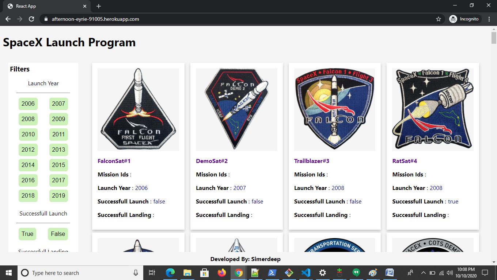
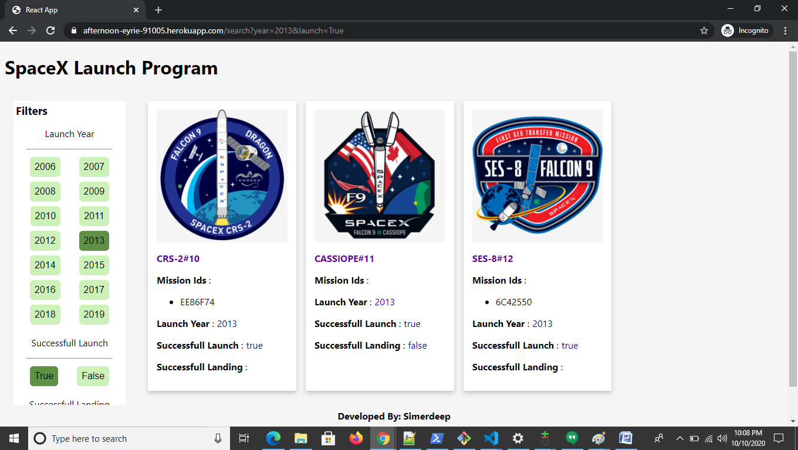
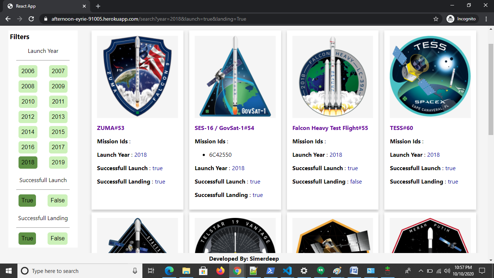
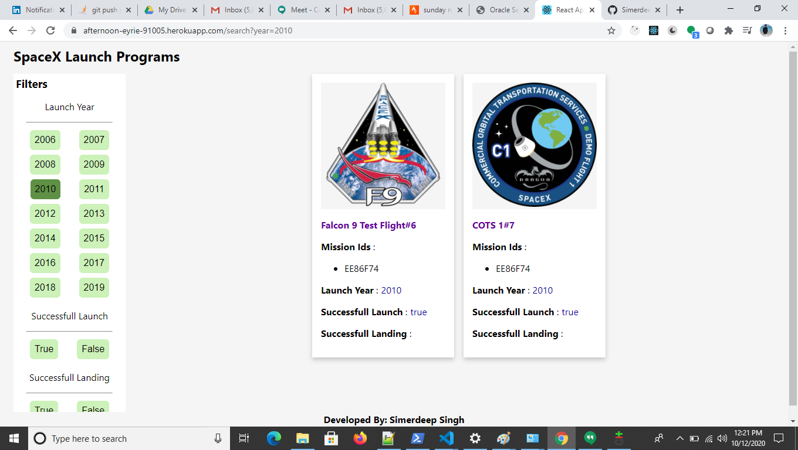

This project was bootstrapped with [Create React App](https://github.com/facebook/create-react-app).

## Stack Details

    Server- Node js 
    Ui - React Js
    Testing - Jest,Enzyme
    Code Quality - Lint, Flow
    Routing - react-router-dom
    Network Library - axios
    Bundling - webpack

## Approach

    -  Divide the design into separate components.
    -  Components Identified - ( Filters and ListView)
    -  Returning the App component from Node for SSR.
    -  Configuring Code quality checks(Lint and Flow)
    -  Configuring testing(Jest)
    -  Creating bundle using webpack
    -  Deploy it on heroku

## Directory Structure

    All components are located in src/components
    All css files are located in src/css
    All test cases for components are located in src/tests
    Server side rendering files are located in src/server

## Available Scripts

In the project directory, you can run:

### `npm start`

To run the node server with the bundle file

### `npm test`

To run the test cases for the project

### `npm run lint`

To run the eslint on the project

### `npm run flow`

To run the flow on the project

### `npm run build`

Builds the app for production to the `build` folder. 
It correctly bundles React in production mode and optimizes the build for the best performance.

The build is minified and the filenames include the hashes. 
Your app is ready to be deployed!

### `npm run heroku-postbuild`

Builds the app for production to the `build` folder. 
It correctly bundles React in production mode and optimizes the build for the best performance.

Builds the server side bundle to the dist folder using webpack.

## Screenshots

